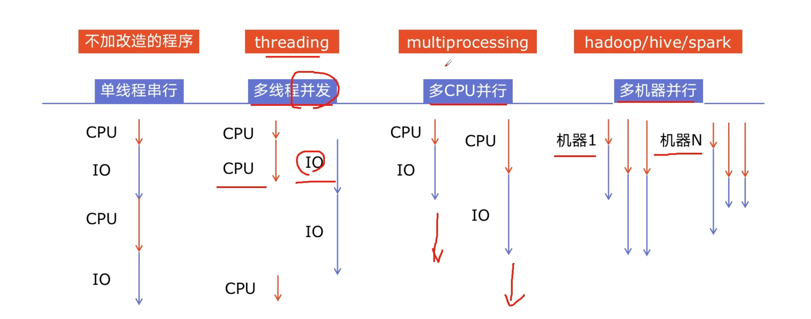

# 1. Python并发编程简介

## 1.1 为什么要引入并发编程？
* 场景1: 1个网络爬虫，按顺序爬去花费1h，采用并发编程减少到20min
* 场景2: 1个APP应用，优化前每次打开页面需要3s，采用异步并发提升到每次200ms

**引入并发原因: 提升程序运行速度。**

## 1.2 有哪些程序提速的方法？

## 1.3 Python对并发编程的支持
### 并发编程模块
* 多线程: `threading`，利用CPU和IO可以同时执行原理，让CPU不会干巴巴等待IO完成
* 多进程: `multiprocessing`，利用多核CPU的能力，真正的并行执行任务
* 异步IO: `asyncio`，在单线程利用CPU和IO同时执行的原理，实现函数异步执行

### 并发编程辅助功能
* `Lock`: 使用Lock对资源加锁，防止冲突访问
* `Queue`: 实现不同线程、进程之间的数据通信，实现生产者-消费者模式
* `线程池Pool`: 简化线程的任务提交、等待结束、获取结果
* `进程池Pool`: 简化进程的任务提交、等待结束、获取结果
* `subprocess`: 使用 subprocess启动外部程序的进程，并进行输入输出交互
