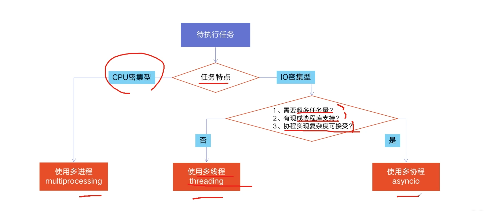

# 2. 如何选择多线程、多进程、协程？

## 2.1 什么是CPU密集型计算、IO密集型计算？
### CPU密集型(CPU-bound)
CPU密集型也叫计算密集型，指I/O在很短的时间就可以完成，CPU需要进行大量计算和处理。

* 特点: CPU占用率高

> 例如: 压缩解压缩、加密解密、正则表达式搜索等。

### IO密集型
IO密集型指 系统运作大部分的状况是CPU在等I/O(硬盘/内存)的读/写操作。

* 特点: CPU占用率低

> 例如: 文件处理程序、网络爬虫程序、读写数据库操作等。

## 2.2 多线程、多进程、多协程对比
### 多进程Process(multiprocessing)
1个进程中，可以启动N个线程。

* 优点: 可以利用多核CPU并行计算
* 缺点: 占用资源最多、可启动数目比线程少

#### 适用场景
CPU密集型计算

### 多线程Thread(threading)
1个线程中，可以启动N个协程。

* 优点
    * 相比进程: 更轻量级、占用资源少 
* 缺点
    * 相比进程: 多线程只能并发执行，不能利用多CPU(GIL限制)
    * 相比协程: 启动数目有限，占用内存资源，有线程切换开销
    
#### 适用场景
IO密集型计算、同时运行的任务数目要求不多

### 多协程Coroutine(asyncio)
* 优点: 内存开销最少、启动协程数量最多
* 缺点: 支持的库有限制(`aiohttp` vs `requests`)、代码实现复杂

#### 适用场景
IO密集型计算、需要超多任务执行、但有现成库支持的场景。

## 2.3 怎样根据任务选择对应技术？

