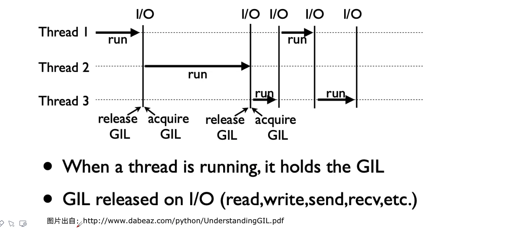
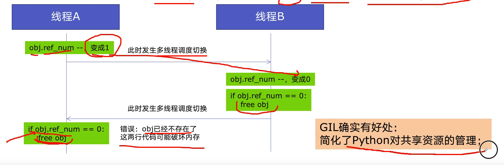

# 3. 全局解释锁 GIL

## 3.1 Python速度慢的2大原因
> 相比 C/C++、Java，Python确实慢，在一些特殊场景下，Python比C++慢100~200倍。
>
> 由于速度慢的原因，很多公司的基础架构依然采用 C/C++ 开发，比如阿里、腾讯等的推荐引擎、搜索引擎、存储引擎等对性能要求高的模块。

Python速度慢的原因有2个:
* 1.Python是动态类型语言，边解释边执行
* 2.GIL: 无法利用多核CPU并发执行

## 3.2 GIL是什么？

> GIL: Global Interpreter Lock，全局解释器锁。

GIL 是计算机设计语言解释器用于线程同步的一种机制，它使得任何时刻仅有1个线程在执行。

`注意`: 即使在多核的处理器上，使用GIL的解释器也只允许同一时间执行1个线程。

由于GIL的存在，即使电脑有多核CPU，单个时刻也只能使用1个，相比并发加速的 C++、Java慢。

## 3.3 为什么有 GIL？
简而言之: Python设计初期，为了规避并发问题引入了GIL，现在想去除却去除不了。

**GIL存在原因: 解决多线程之间 数据完整性 和 状态同步 的问题。**

Python中对象的管理，是使用引用计数器进行的，引用数为0则释放对象。

举例:
* 线程A: 引用对象 obj
* 线程B: 引用对象 obj

obj.ref_num=2，线程A和线程B都想撤销对obj的引用:

## 3.4 如何规避 GIL带来的限制？
* 1、多线程 `threading` 机制仍然是有用的，用于IO密集型计算

因为在I/O(read、write、send、recv等)期间，线程会释放 GIL，实现CPU和IO的并行，因此多线程用于IO密集型计算依然可以大幅度提升速度。
  
`注意`: 但是多线程用于CPU密集型，只会更加拖慢速度。

* 2、使用 `multiprocessing` 的多进程机制实现并行运算，利用多核CPU优势

为了应对GIL的问题，Python提供了 `multiprocessing`。
