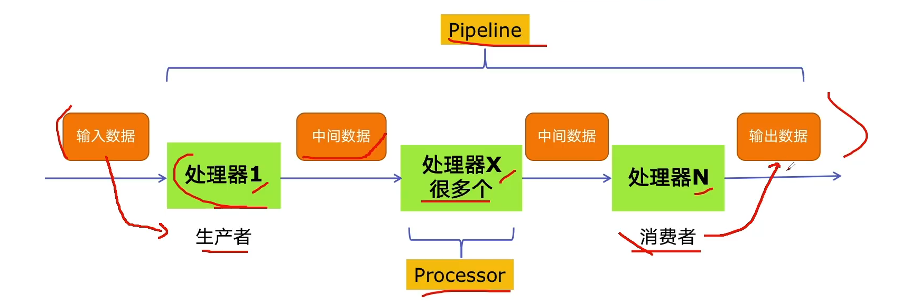
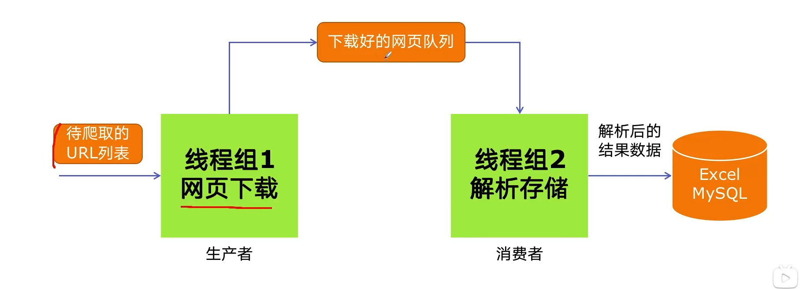

# 5. Python实现生产者消费者爬虫

## 5.1 多组件 Pipeline 技术架构
复杂的事儿一般都不会一下子做完，而是分为很多中间步骤一步一步完成。




## 5.2 生产者消费者爬虫架构




## 5.3 多线程数据通信: `queue.Queue`
`queue.Queue` 可用于多线程之间、**线程安全**的数据通信。

```python
# 1、导入queue模块
import queue

# 2、创建Queue
q = queue.Queue()

# 3、添加元素
q.put(item)

# 4、获取元素
item = q.get()

# 5、查询状态
# 查看元素个数
q.qsize()
# 判断是否为空
q.empty()
# 判断是否已满
q.full()
```


## 5.4 代码编写实现生产者消费者爬虫

