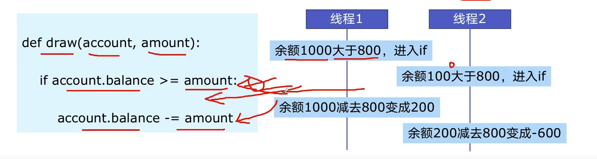

# 6. 线程安全问题 及 解决方案

## 6.1 线程安全概念介绍
**线程安全: 指某个函数、函数库在多线程环境被调用时，能正确处理多个线程之间的共享变量，使程序功能正确完成。**

由于线程的执行随时会发生切换，就造成了不可预料的结果，出现线程不安全。

如:
```python
def draw(account, amount):
    if account.balance >= amount:
        account.balance -= amount
```




## 6.2 Lock: 解决线程安全问题
### 解决方案1: try-finally模式
```python

import threading
lock = threading.Lock()


lock.acquire()

try:
    # do something
finally:
    lock.release()
```

### 解决方案2: with模式
```python
import threading


lock = threading.Lock()

with lock:
    # do somemthing
```

## 6.3 代码演示问题及解决方案

