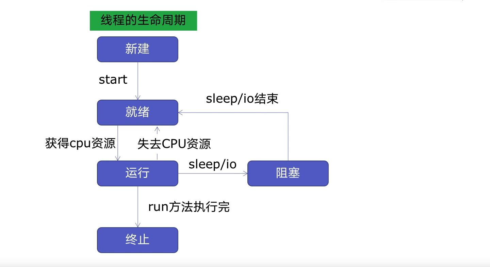
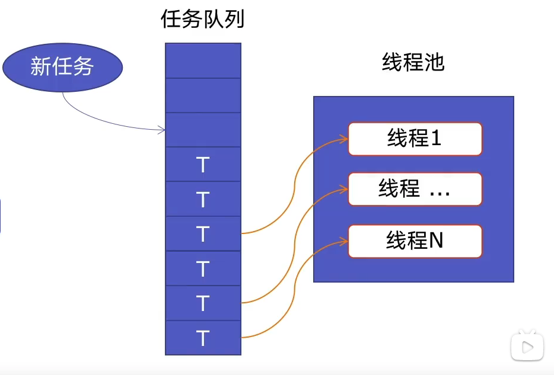

# 7. 线程池: `ThreadPoolExecutor`

## 7.1 线程池原理

### 线程生命周期




* 新建线程，系统需要分配资源
* 终止线程，系统需要回收资源

> 如果可以重用线程，则可以减去 新建/终止的开销。

### 线程池原理




## 7.2 线程池好处

* 1.提升性能: 因为减去了大量新建、终止线程的开销，重用了线程资源
* 2.适用场景: 适合处理 突发性大量请求 或 需要大量线程完成任务，但实际任务处理时间较短。
* 3.防御功能: 能有效避免因为创建线程过多，而导致系统负荷过大相应变慢等问题
* 4.代码优势: 线程池语法 比 新建线程执行线程更加简洁


## 7.3 `ThreadPoolExecutor`语法
### 用法1: `map` 函数(推荐)
`注意`: `map` 的结果和入参是顺序对应的。

```python
from concurrent.futures import ThreadPoolExecutor, as_completed


with ThreadPoolExecutor() as pool:
    results = pool.map(craw, urls)
    for result in results:
        print(result)
```

### 用法2: `future` 模式(强大)
`注意`: 如果用 `as_completed` 返回结果的顺序是不固定的。
```python
from concurrent.futures import ThreadPoolExecutor, as_completed


with ThreadPoolExecutor() as pool:
    futures = [pool.submit(craw, url) for url in urls]
    for future in futures:
        print(future.result())

    for future in as_completed(futures):
        print(future.result())
```


## 7.4 使用线程池改造爬虫程序

