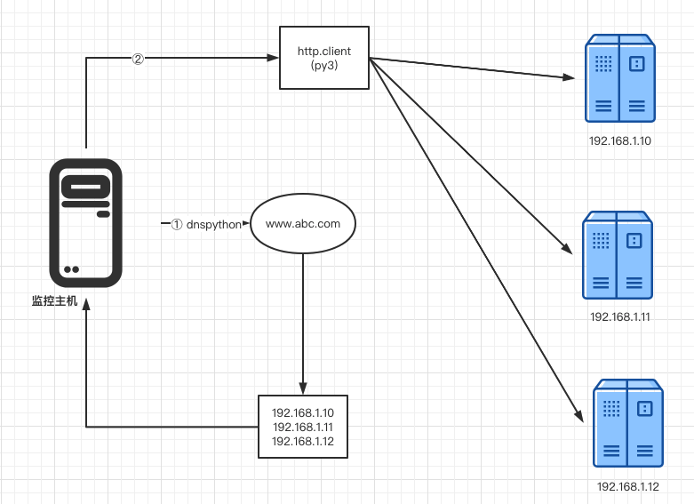

# 4. DNS多域名服务器监控

## 4.1 DNS 轮询

大部分的DNS解析都是一个域名对应一个IP地址，但是通过DNS轮循技术可以做到一个域名对应多个IP，从而实现最简单且高效的负载平衡。
 
`弊端`: 目标主机不可用时无法被自动剔除。
 
因此做好业务主机的服务可用监控至关重要。
 

## 4.2 服务监控思路

本示例通过 分析当前域名的解析IP，再结合服务端口探测来实现自动监控，在域名解析中添加、删除IP时，无须对监控脚本进行更改。
 
实现架构图如下图所示:

## 4.3 服务监控步骤
* 1.实现域名的解析，获取域名所有的A记录解析IP列表
* 2.对IP列表进行HTTP级别的探测
