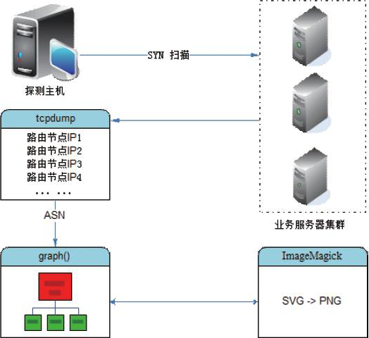

# 3. `scapy`模块监控路由

## 3.1 `scapy` 介绍
scapy是一个强大的交互式数据包处理程序,它能够对数据包进行伪造或解包,包括发送数据包、包嗅探、应答和反馈匹配等功能。

可以用在:
* 处理网络扫描
* 路由跟踪
* 服务探测
* 单元测试等
  
本节主要针对 scapy的路由跟踪功能,实现TCP协议方式对服务可用性的探测。

比如常用的80(HTTP)与443(HTTPS)服务,并生成美观的路由线路图报表,让管理员清晰了解探测点到目标主机的服务状态、骨干路由节点所处的IDC位置、经过的运营商路由节点等信息。


## 3.2 `scrapy`安装

```shell
pip3 install scapy
```


## 3.3 `scrapy`常用方法
scapy模块提供了众多网络数据包操作的方法,包括:
* 发包: `send()`
* SYN\ACK扫描、嗅探: `sniff()`
* 抓包: `wrpcap()`
* TCP路由跟踪: `traceroute()`
  
本节主要关注服务监控内容接下来详细介绍 `traceroute()` 方法。

### `traceroute()` 方法
```python
from srapy.all import tracerouter

traceroute(target, dport=80, minttl=1, maxttl=30, sport=<RandShort>, l4=None, filter=None, timeout=2, verbose=None, **kargs)
```

#### 参数说明
* `target`：跟踪的目标对象，可以是域名或IP，类型为列表，支持同时指定多个目标，如["www.qq.com"，"www.baidu.com"，"www.google.com.hk"]
* `dport`：目标端口，类型为列表，支持同时指定多个端口，如[80，443]
* `minttl`：指定路由跟踪的最小跳数（节点数）
* `maxttl`：指定路由跟踪的最大跳数（节点数）


## 3.4 实现TCP探测目标服务路由轨迹

### 实现原理

通过 `scapy` 的` traceroute()` 方法 实现 探测机到目标服务器的路由轨迹。

整个过程的原理见下图:


  
* 1.首先通过 探测机 以 SYN方式 进行 TCP服务扫描
* 2.同时启动 `tcpdump` 进行抓包，捕获扫描过程经过的所有路由点
* 3.再通过 `graph()` 方法进行路由IP轨迹绘制，中间调用 `ASN` 映射查询IP地理信息并生成svg流程文档
* 4.最后使用 `ImageMagick` 工具将svg格式转换成png，流程结束

